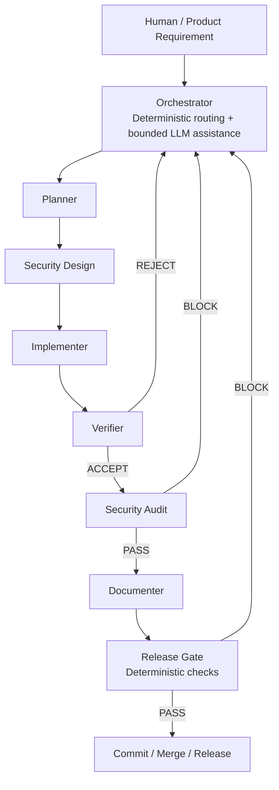

# Nomphi Agentic SDLC

Nomphi Agentic SDLC is the reusable engineering architecture for **all Nomphi software projects**.

It defines **how Nomphi develops software**. It does not define the domain, stack, product rules, UX language or invariants of any specific project.

Project-specific knowledge is injected through a separate project adapter under `.nomphi/project/`.

<p align="center">
  
</p>

> **Nomphi defines how software is developed. Each project defines what is being developed.**

## Current baseline

`NOM-TEST-007` is closed and integrated into `main`.

Validated baseline:
- workflow completed through `RELEASED`;
- full smoke validated;
- 30 tests passing;
- canonical project identity contract exercised end-to-end;
- OpenCode role bindings validated with the current frontier-model configuration.

Key commits:
- `a1b29f3` — Merge NOM-TEST-007 project identity smoke
- `e3d7cc3` — Configure OpenCode agent model bindings
- `ba9a263` — Complete NOM-TEST-007 project identity smoke

The next framework phase is `NOM-FWK-008 — Framework Hardening`. Its purpose is to harden deterministic contracts before adding new projects or more automation. See [`docs/FRAMEWORK_HARDENING.md`](docs/FRAMEWORK_HARDENING.md).

## Scope boundary

```text
NOMPHI CORE                         PROJECT ADAPTER
───────────                         ───────────────
How work is planned                What this product is
How agents collaborate             Domain language
How risk is classified             Architecture already in use
How quality is verified            Stack and repository conventions
How security is audited            Product invariants
How release is gated               Project-specific skills
                                   Commands: test/lint/typecheck/E2E
```

**Core must never contain project-specific rules.** A project can extend the system, but it must not weaken core release/security rules silently.

## Agent architecture



The same Security Agent is invoked in two distinct phases: security design before implementation and adversarial audit after independent functional verification.

## Roles

| Role | Responsibility |
|---|---|
| Orchestrator | Routing, context packaging, handoffs, state and gates. Must not implement product changes. |
| Planner | Architecture, bounded specification, acceptance criteria and edge cases. Must not implement production code. |
| Security | Threat modelling and independent AppSec audit. |
| Implementer | Implementation, local tests and bounded refactors within the approved spec. |
| Verifier | Independent correctness review and adversarial tests. Must not silently repair the implementation under review. |
| Documenter | Durable technical documentation based only on accepted behavior and required handoffs. |
| Release | Deterministic evidence-based final gate. It cannot waive failed mandatory checks. |

Model bindings are configuration, not architecture. Frontier model versions can change without modifying the workflow.

## Repository layout after installation

```text
.nomphi/
├── core/                       # Nomphi-owned reusable architecture
│   ├── agents/
│   ├── config/
│   ├── manifests/
│   ├── schemas/
│   ├── skills/
│   └── templates/
├── project/                    # Project-owned adapter/context
│   ├── project-profile.json
│   ├── architecture.md
│   ├── domain.md
│   ├── invariants.md
│   ├── conventions.md
│   ├── security-boundaries.md
│   ├── commands.json
│   └── skills/
└── tasks/                      # Persistent task contracts and reports

.opencode/agents/               # OpenCode runtime adapters
scripts/nomphi.py               # Deterministic workflow helper
AGENTS.nomphi.md                # Portable repository-wide agent policy
```

## Core precedence

For a task, context is assembled in this order:

1. Nomphi core manifest and immutable gates.
2. Project adapter and project invariants.
3. Selected shared/project skills.
4. Approved task specification.
5. Current iteration findings/handoff.

Project rules may become stricter than the core. They may not silently relax a core security/release rule.

## Fail-closed framework rule

Nomphi must not depend on an agent voluntarily following role boundaries or reconstructing missing context.

The framework must reject progression when:
- a required handoff is absent, empty, stale or belongs to another `project_id`/`task_id`;
- a structured readiness field is unresolved;
- a role attempts an action outside its authority;
- a transition is illegal for the current state;
- release evidence does not belong to the same project/task identity or a mandatory gate has not passed.

Explanatory prose containing literals such as `PENDING` or `REPLACE_ME` must not by itself determine readiness. Readiness is a structured contract.

## Install into a project

```bash
./bootstrap.sh /path/to/repository --name "My Project" --id my-project
```

`--id` is the human-supplied canonical project identifier. It must exactly match `^[a-z0-9]+(?:-[a-z0-9]+)*$`; it is not derived from the project name, repository, directory, or task ID. Bootstrap copies the reusable core and project adapter, marks only the target copy's identifier uninitialized, and then explicitly initializes it from `--id`. It does not modify the donor adapter or copy an example project.

After initialization, the identifier is immutable: `project-init` accepts the same exact ID for metadata updates but rejects a different ID. New task state copies the profile identifier exactly, and task operations reject state whose identifier is missing, malformed, or differs from the current profile.

Then edit:

```text
.nomphi/project/project-profile.json
.nomphi/project/architecture.md
.nomphi/project/domain.md
.nomphi/project/invariants.md
.nomphi/project/conventions.md
.nomphi/project/security-boundaries.md
.nomphi/project/commands.json
```

## Create a task

```bash
python3 scripts/nomphi.py task-init NOM-001 \
  --title "Implement feature" \
  --risk MEDIUM

python3 scripts/nomphi.py status NOM-001
python3 scripts/nomphi.py next NOM-001
```

Task artifacts are stored under `.nomphi/tasks/NOM-001/`.

## OpenCode

`.opencode/agents/` contains runtime adapters for each Nomphi role. The Nomphi manifests remain canonical. Provider-specific agent files are only adapters, so OpenCode or model changes do not redefine the engineering process.

Current validated bindings are documented in [`docs/OPENCODE.md`](docs/OPENCODE.md).

## Examples

`examples/` contains optional project adapters showing how the generic core can be specialized. They are **not part of the Nomphi core** and are never installed by default. Their profile identifiers are compatibility examples, not identifiers for an active project; an active adapter requires an explicit human-supplied identifier in the approved format.

## Non-goals

This system is not:
- a project-management suite;
- a replacement for Git/CI;
- a guarantee that LLM-generated code is correct;
- permission for agents to deploy autonomously;
- a place to store historical chat transcripts.

It is a controlled multi-agent SDLC with explicit separation of duties, persistent artifacts and deterministic quality gates.
